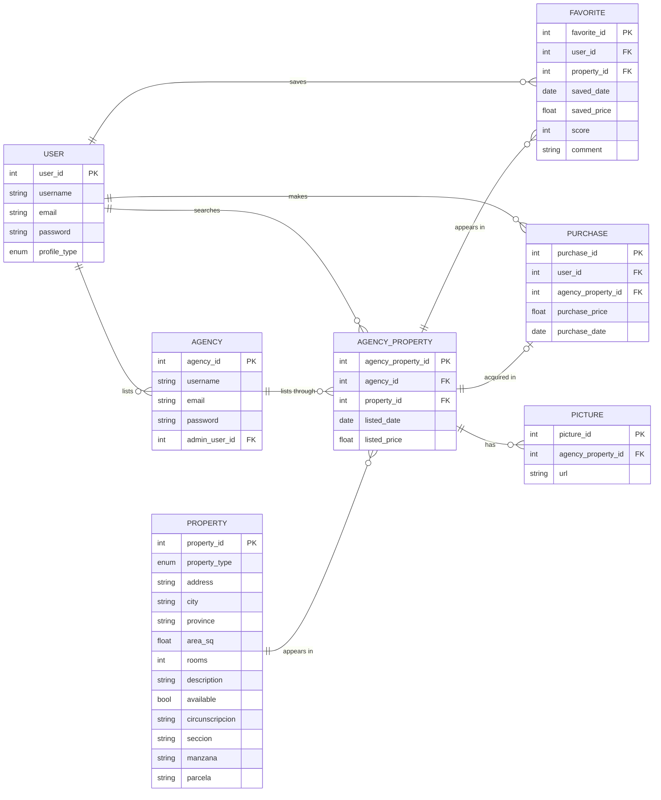

# UNQ - PDES - 2026 c1
## Aplicación Compra tu Hogar (CTH)

### Enunciado
[doc](https://docs.google.com/document/d/1HdWZfd2t0L3aWw08RnvoGvPg9YEU4v5jv9J2NPIPwcg/edit?usp=sharing)

### Diagrama entidad relación

<!-- mermaid-sync -->

<!-- /mermaid-sync -->

### Integrantes
- Juan Hualampa
- Sofia Justiniano

